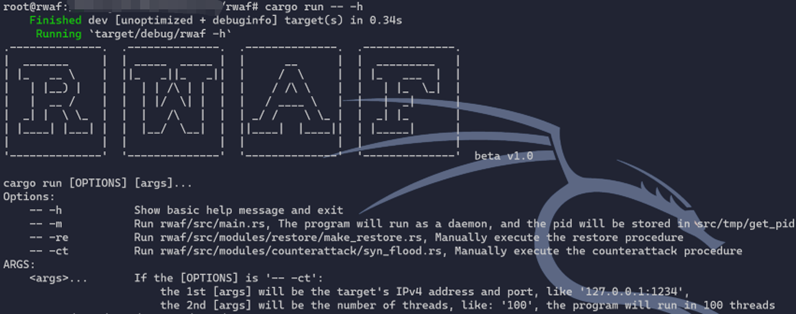

<!--
 * @Author       : 白银
 * @Date         : 2023-01-31 21:22:22
 * @LastEditors  : 白银
 * @LastEditTime : 2023-04-06 20:28:37
 * @FilePath     : /rwaf/README.md
 * @Description  : 
 * @Attention    : 
 * @Copyright (c) 2023 by 白银 captain-jparrow@qq.com, All Rights Reserved.
-->

# waf based on rust

`openssl` & `bison` & `flex` & `libpcap` & `python-requests` needed(maybe)

`sqlmap` needed

`iptables` or `firewalld` needed

```rustup toolchain install nightly```

make sure that you've been able to connect to the bak_server by `ssh-key` before using the `restore` module

**This is a graduation project from [School of Computer Science of THNU](https://jsjxy.thnu.edu.cn)**

~~***Not yet completed, under development***~~

~~***Preliminary development completed 2023.02.18***~~

***Will be updated irregularly 2023.04.04***

# todo
- [ ] 100%Rust化，并尽量剔除第三方功能实现，如命令执行等
    - [x] 获取日期··········································································2022.04.06
    - [x] 获取时间··········································································2022.04.06
    - [x] 获取CPU负载·······································································2022.04.06
    - [ ] 获取内存占用
    - [ ] 获取磁盘响应时间
    - [ ] 获取上传带宽占用
    - [ ] 获取下载带宽占用
    - [ ] 简单webshell检测
    - [ ] 备份
    - [ ] 恢复
    - [ ] 端口扫描
    - [ ] sql注入点检测
    - [ ] xss注入点检测
- [ ] 备份过程加密传输
- [ ] 可指定时区，通过配置[config](src/config)文件实现
- [x] 守护进程·············································································2022.02.18
- [x] 写入数据库···········································································2022.02.17
- [x] 优化反击模块·········································································2022.02.17
- [x] 在响应记录数据库中，写入ban掉的ip及当时日期时间，手动恢复日期时间，手动反击日期时间目标ip···2022.02.17

# how to use 
`cargo run [OPTIONS] <args>...`

Options:

    -- -h           Show basic help message and exit
    -- -m           Run rwaf/src/main.rs, and the pid will be stored in src/tmp/get_pid
    -- -re          Run rwaf/src/modules/restore/make_restore.rs, Manually execute the restore procedure
    -- -ct          Run rwaf/src/modules/counterattack/syn_flood.rs, Manually execute the counterattack procedure

ARGS:

    <args>...       If the [OPTIONS] is '-- -ct': 
                        the 1st [args] will be the target's IPv4 address and port, like '127.0.0.1:1234',
                        the 2nd [args] will be the number of threads, like: '100', the program will run in 100 threads

## for example
`cargo run -- -h`

